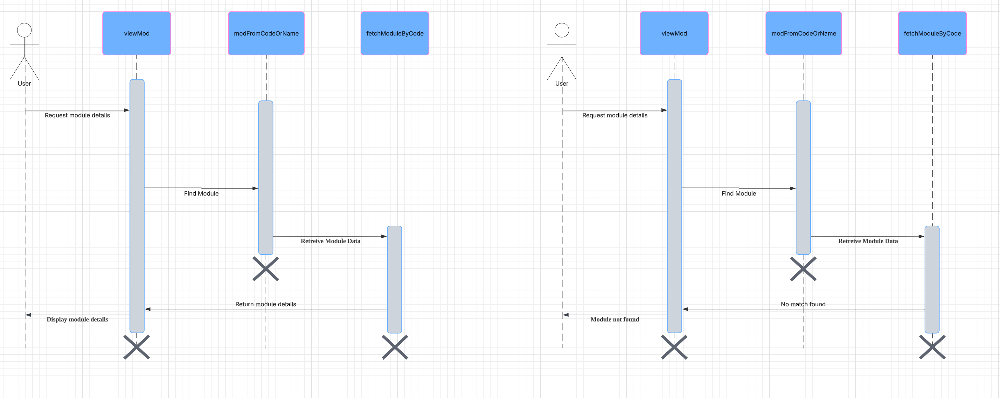

# Developer Guide

## Acknowledgements

{list here sources of all reused/adapted ideas, code, documentation, and third-party libraries -- include links to the original source as well}

## Design & implementation

{Describe the design and implementation of the product. Use UML diagrams and short code snippets where applicable.}

### View Module Details Feature

#### Proposed Implementation

The viewMod feature allows users to retrieve and display details about a module by providing its code or name. This functionality relies on fetching module data from an external API and handling cases where the requested module is not found.
The feature is implemented in the viewMod function, which operates as follows:
- It asserts that the input is neither null nor empty.
- It attempts to retrieve the module using modFromCodeOrName.
- If a match is found, it displays the detailed module information and logs the action.
- If no match is found, it informs the user and logs the failure.

This feature involves the following key operations:
- `viewMod(inputCodeOrName)`: Main entry point for viewing module details.
- `modFromCodeOrName(modCodeOrNameGiven)`: Attempts to find a module based on the provided code or name.
- `fetchModuleByCode(moduleCode)`: Fetches module details from the NUSMods API.

#### Example Usage Scenario
Step 1: User Requests Module Details
- The user enters a module code or name. The viewMod function is triggered, and the system logs the request.

#### Step 2: System Attempts to Retrieve Module Data
- The system checks for a module matching the provided input using modFromCodeOrName. If found, it retrieves full details from fetchModuleByCode.

#### Step 3a: Module Found
- If a module is found, its details are displayed, and a log entry is saved.

#### Step 3b: Module Not Found

- If no module is found, an error message is displayed, and the failure is logged.

### Design Considerations
#### Aspect: Data Retrieval Method

Alternative 1 (Current Choice): Fetch from External API Each Time
- Pros: Ensures the latest module details are always retrieved.
- Cons: API calls may introduce latency.

Alternative 2: Cache Module Data Locally
- Pros: Reduces API calls, improving performance.
- Cons: Data may become outdated without a refresh mechanism.

#### Aspect: Error Handling

Alternative 1 (Current Choice): Log Errors and Return Empty Result
- Pros: Ensures errors are recorded for debugging.
- Cons: Users do not receive detailed error messages.

Alternative 2: Provide User-Friendly Error Messages
- Pros: Helps users understand failures.
- Cons: Adds complexity in differentiating error types.
### Summary
The viewMod feature provides a simple way to retrieve and display module details based on user input. It ensures robustness by handling errors and logging events while maintaining a straightforward implementation that prioritizes real-time data retrieval. Future improvements may include caching for performance optimization and enhanced error messaging.

## Product scope
### Target user profile

{Describe the target user profile}

### Value proposition

{Describe the value proposition: what problem does it solve?}

## User Stories

|Version| As a ... | I want to ... | So that I can ...|
|--------|----------|---------------|------------------|
|v1.0|new user|see usage instructions|refer to them when I forget how to use the application|
|v2.0|user|find a to-do item by name|locate a to-do without having to go through the entire list|

## Non-Functional Requirements

{Give non-functional requirements}

## Glossary

* *glossary item* - Definition

## Instructions for manual testing

{Give instructions on how to do a manual product testing e.g., how to load sample data to be used for testing}
